<div align="center">

# VeilDraw — Private Giveaway Platform

### Zero-Knowledge Proof Giveaways on Midnight

[](https://github.com/mathsphile/pgpapp/actions)
[](https://opensource.org/licenses/MIT)
[](https://nodejs.org)
[](https://docs.midnight.network)
[](https://www.risein.com/programs/new-moon-to-full-monthly-moonshots-on-midnight)

**[Live Demo](https://pgpapp.vercel.app) • [Demo Video](https://youtu.be/meczmnhMPWo) • [Preview Faucet](https://faucet.preview.midnight.network/)**

[](https://youtu.be/meczmnhMPWo)

</div>

---

## Overview

VeilDraw is a privacy-preserving giveaway platform built on [Midnight](https://midnight.network). Organizers escrow prizes in a Compact smart contract; participants enter with locally-generated ZK commitments; winners claim prizes by proving ticket ownership in zero knowledge — no wallet addresses, identities, or entry lists are ever published on-chain.

The frontend is a premium **Next.js 15** static dApp (React 19, Tailwind, Framer Motion, shadcn/ui) that reads live state from the Midnight indexer and connects to Lace / 1AM wallets through the official DApp Connector API (CAIP-372).

This project is deployed against the **Midnight Preview Testnet** and is submitted for the **Rise In × Midnight "New Moon to Full" program — Level 3 (First Quarter): Production-Grade dApp**.

---

## Contract Address & Deployment

| Network | Contract Address | Status |
|---------|------------------|--------|
| **Preview** | `445563f8b0fa114ba33cde6a66f6de928de1f2a7bbe55a89ab4033d0b4dfe4b1` | **Active** — live giveaway on-chain |
| Preprod | — | Dust-ledger sync exceeds laptop RAM; Preview used instead |

| Deployment fact | Value |
|-----------------|-------|
| Active giveaway | `PGP Launch Giveaway` (5,000 tNIGHT prize) |
| Deploy transaction | `04bc1dfc7570ba3835dbf8ac940ecc52e2997fa535c39ea6faf463a3b1466443` |
| Verified at block | 511,326 (Preview indexer `contractAction`) |
| Organizer wallet | `mn_addr_preview1d92nezft59hhefh23eaepu627w90537hce8p0g629vescrymuxrq8wc8fq` |

### Verify On-Chain (Preview)

- [Preview Node RPC](https://rpc.preview.midnight.network)
- [Preview Indexer GraphQL](https://indexer.preview.midnight.network/api/v4/graphql)
- [Preview Faucet Portal](https://faucet.preview.midnight.network/)

---

## Privacy Model

The contract maintains a ZK accumulator tree of private entry commitments and accepts a private witness (ticket secret) that must match the organizer-selected winning commitment before the prize can be claimed.

**What is PUBLIC (on-chain, visible to anyone):**
- The entry accumulator state, entry count, winning commitment hash, and winner-claimed status.

**What is PRIVATE (local / private witness, never published):**
- The participant's ticket secret, nonce, and secret key — generated and held on the user's device.

**What the user PROVES without revealing:**
- That their ticket secret hashes to the winning commitment, and that the claim transition is valid — via `persistentHash` inside the ZK circuit. The UI surfaces proof status and on-chain results only; raw secrets never leave the device.

---

## App Architecture

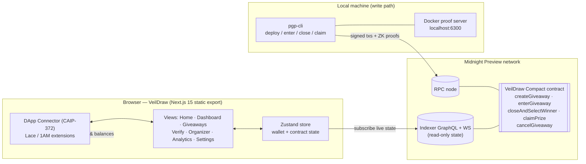

**Design notes**

- **Read path (browser):** the UI subscribes to the Preview indexer over GraphQL/WebSocket and renders live contract state — no simulated data anywhere.
- **Write path (CLI):** proving + signing requires the local proof server, so `pgp-cli` submits real transactions (deploy, enter, close, claim) against the RPC node.
- **Wallet connect:** the browser uses the real injected `window.midnight.*` connector (`connect(networkId)` → `getUnshieldedAddress()` / `getShieldedAddresses()` / balances). No fabricated fallback addresses.
- **Single network source:** `pgp-ui/lib/network.ts` derives every label/endpoint from `NEXT_PUBLIC_NETWORK_ID` (`build:preview` / `build:preprod`).

### Repository Structure

```
pgpapp/
├── contract/            # Compact ZK contract + 17 Vitest tests
│   ├── src/             #   pgp.compact, witnesses.ts, managed/ (compiled zkir + keys)
│   └── test/pgp.test.ts
├── api/                 # Shared API types & helpers
├── pgp-cli/             # Interactive CLI: deploy / join / enter / close / claim
│   └── src/             #   launchers: preview.ts, preprod.ts, standalone.ts
├── pgp-ui/              # Next.js 15 App Router static dApp
│   ├── app/             #   routes: / /dashboard /giveaways /verify /organizer /analytics /settings
│   ├── components/      #   views, layout, modals (Wallet, Transaction)
│   ├── lib/             #   store, network config, types, utils
│   └── utils/           #   midnightWallet (connector), midnightService (indexer)
├── .github/workflows/   # ci.yml — CI/CD pipeline
├── docs/screenshots/    # desktop + mobile captures
├── vercel.json          # CD: auto-deploy to Vercel on main
└── PROPOSAL.md          # product proposal
```

---

## User Flow

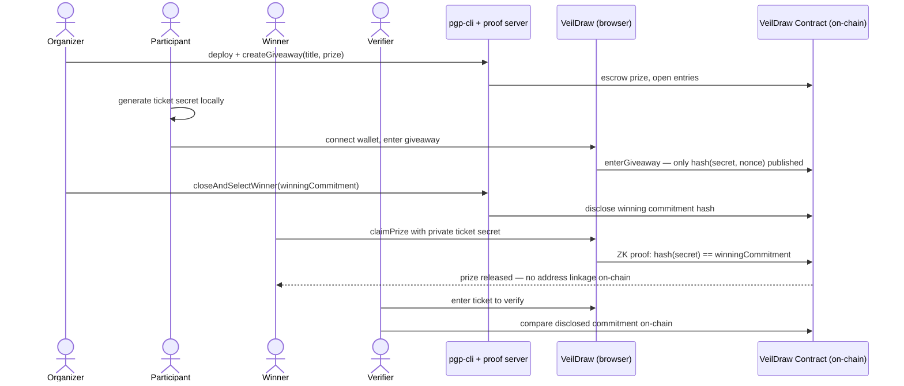

1. **Organizer** deploys the contract and creates a giveaway; the prize is escrowed.
2. **Participant** connects Lace/1AM, generates a ticket secret in-browser, and submits only the commitment hash.
3. **Organizer** closes entries and selects the winning commitment off-chain.
4. **Winner** proves ticket ownership in zero knowledge and claims — the chain never learns which address won.
5. **Verifier** (anyone) can independently confirm a winning ticket against the disclosed commitment.

---

## Screenshots

### Desktop (1440px)

| Home | Dashboard |
|:---:|:---:|
| 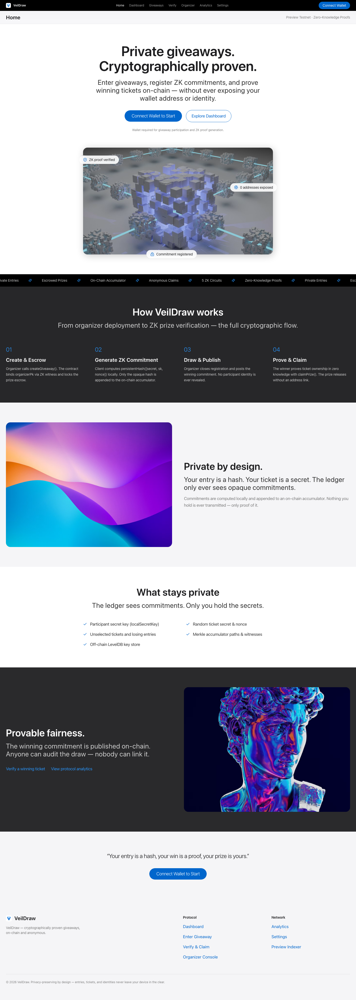 | 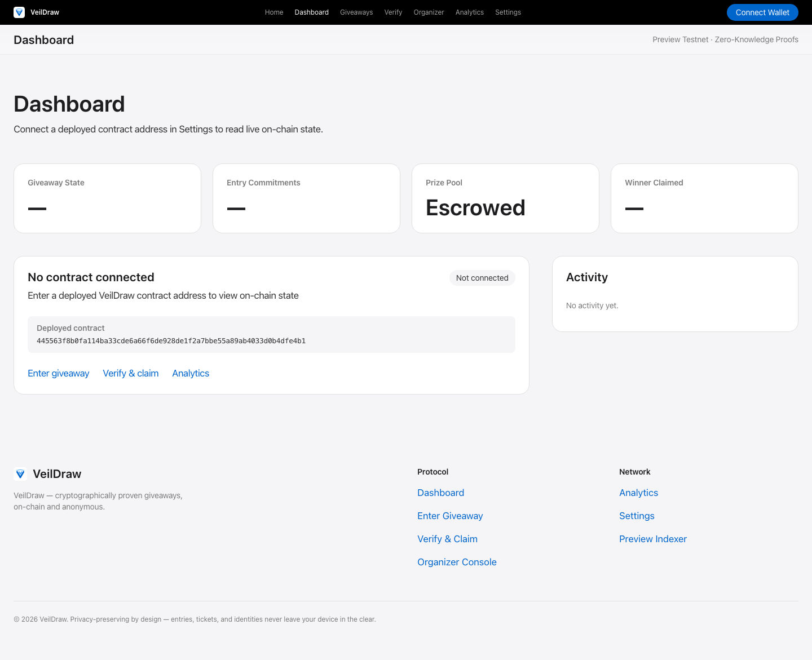 |

| Giveaways | Analytics |
|:---:|:---:|
| 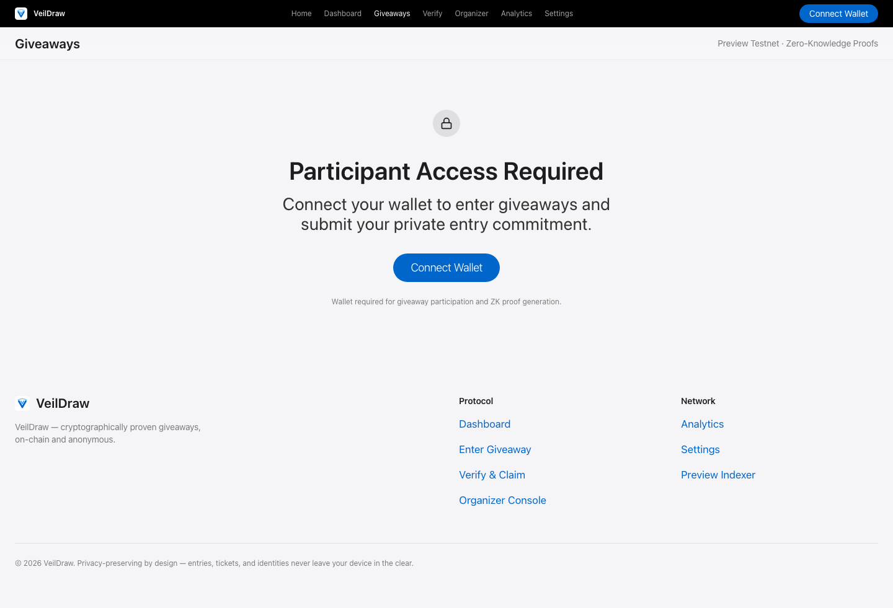 | 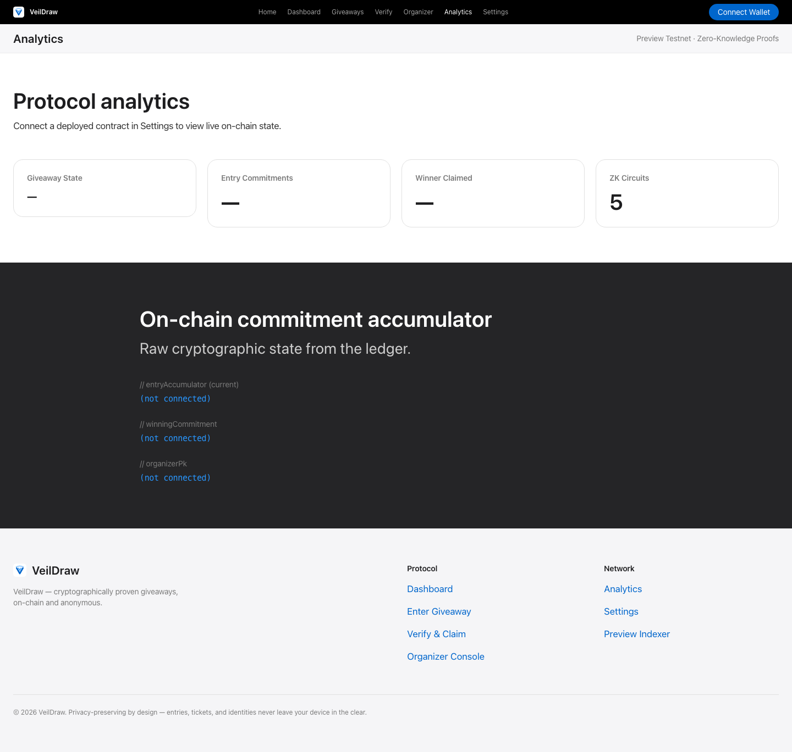 |

| Winner Verification | Organizer Console |
|:---:|:---:|
| 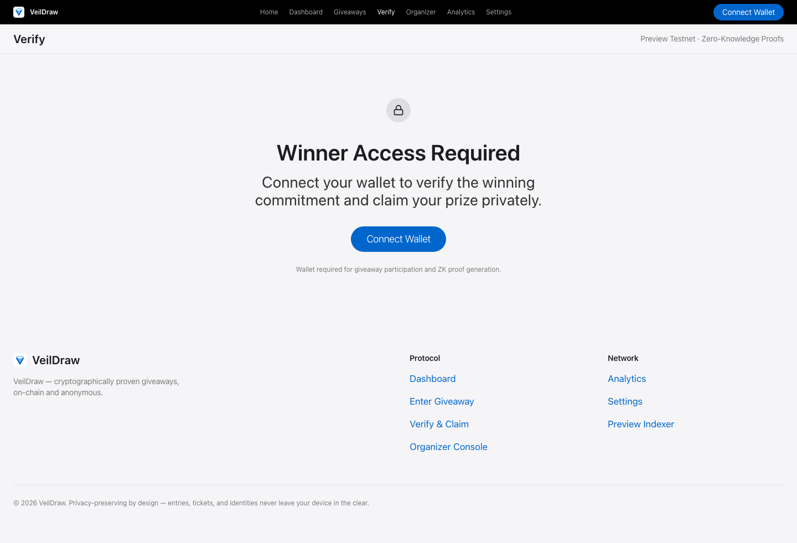 | 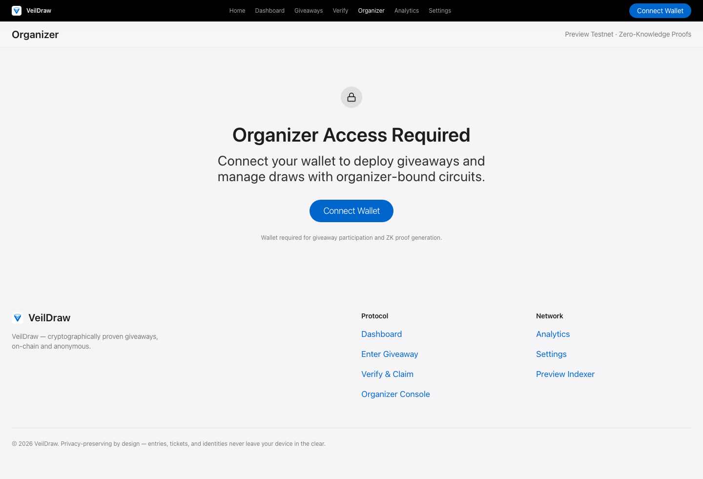 |

| Settings | |
|:---:|:---:|
| 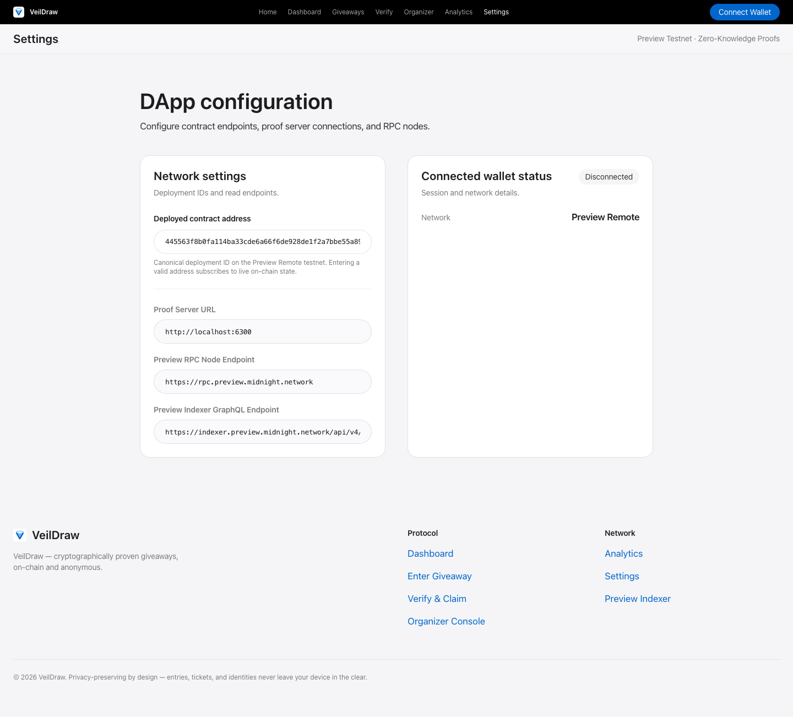 | |

### Mobile (390×844)

| Home | Dashboard | Giveaways |
|:---:|:---:|:---:|
| 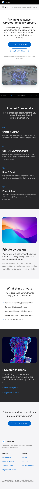 | 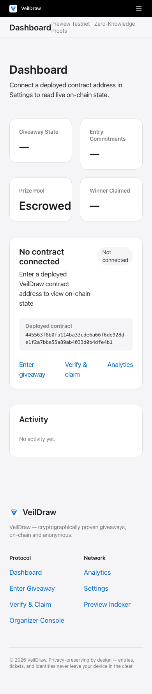 | 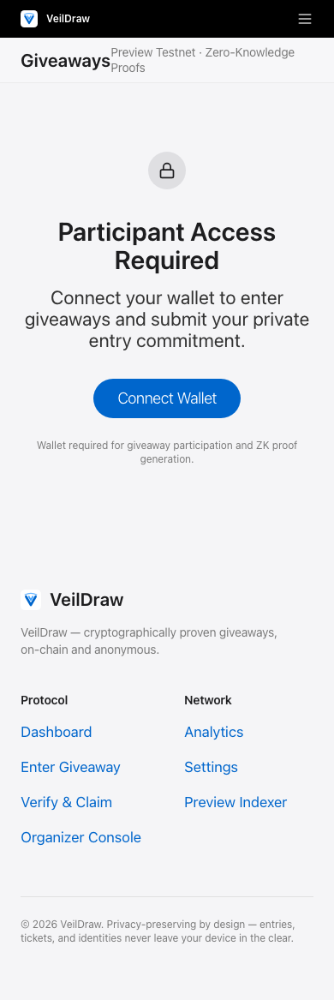 |

---

## Rise In "New Moon to Full" — Level 3 Checklist

Level 3 (First Quarter) requires a **polished dApp**, **tests**, **CI/CD**, and a problem picked from the provided list (privacy-preserving on-chain verification). Status:

| Requirement | Status |
|-------------|--------|
| Polished, production-grade dApp | ✅ Next.js 15 premium UI — animated hero, scroll reveals, marquee, frosted sub-nav, pill CTAs; fully responsive (desktop + mobile screenshots above) |
| 3+ meaningful tests (circuit / state / privacy) | ✅ **17 Vitest tests** in [`contract/test/pgp.test.ts`](contract/test/pgp.test.ts) |
| CI/CD pipeline on push to main | ✅ [`.github/workflows/ci.yml`](.github/workflows/ci.yml) — typecheck → lint → test → build (4 workspaces) → Vercel deploy |
| CI badge in README | ✅ Top of this file |
| Contract address in README, verifiable on-chain | ✅ Preview address + deploy tx + block height above |
| Privacy model documented | ✅ Privacy Model section above |
| UI reads real on-chain state | ✅ Indexer GraphQL/WS subscription — no simulated transactions |
| Real wallet integration | ✅ Lace / 1AM via `@midnight-ntwrk/dapp-connector-api` (CAIP-372) |
| dApp builds with zero errors | ✅ `npm run build` green across all workspaces |
| Product proposal | ✅ [PROPOSAL.md](PROPOSAL.md) |
| Problem statement addressed | ✅ Private, verifiable giveaways — ZK winner selection without identity disclosure |

### Test Suite

17 tests covering: pure circuit behavior, witness extraction privacy, private-state isolation, state-machine constraints, compiled contract shape, and publicKey determinism.

```bash
npm test --workspace=@midnight-ntwrk/pgp-contract -- --run
```

### CI/CD

**CI** runs on every push to `main`/`dev` and every PR: checkout → Node 24 → install → contract typecheck → contract lint → unit tests → build contract, API, CLI, and UI workspaces.

**CD** deploys the UI to Vercel on every push to `main` (`vercel.json`), live at [pgpapp.vercel.app](https://pgpapp.vercel.app).

---

## Level History

### Level 1 — New Moon: Setup & First Contract

Compact contract with a ZK entry accumulator, local Vitest suite, and testnet deployment with documented privacy behavior. Tech: Compact, Node 24, Docker proof server.

### Level 2 — Waxing Crescent: Frontend Integration

Contract wired to a browser UI with Lace/1AM connect + disconnect via the DApp Connector API, circuit calls (`enterGiveaway`, `closeAndSelectWinner`, `claimPrize`) with honest error handling, and local private-state management.

### Level 3 — First Quarter: Production-Grade dApp *(this submission)*

- Rebuilt the frontend as a **Next.js 15 App Router** static export with a premium, animated, fully responsive design system.
- Full test suite, CI/CD pipeline, Vercel CD, live on-chain state, architecture & user-flow documentation, desktop + mobile screenshots.

---

## Quick Start

### Prerequisites

- Node.js v24.11.1+
- Docker (proof server)
- Lace or 1AM wallet extension set to **Preview**

### Run the UI

```bash
git clone https://github.com/mathsphile/pgpapp.git
cd pgpapp
npm install
npm run dev                      # Next.js dev server
# or production static build for Preview:
npm run preview                  # build:preview + serve ./out
```

### Run the CLI (deploy / interact)

```bash
docker run -d --name pgp-proof-server --rm -p 6300:6300 -e PORT=6300 midnightntwrk/proof-server:8.1.0
cd pgp-cli
npm run preview-remote           # interactive: deploy / join / enter / close / claim
```

### Scripts

| Script | Purpose |
|--------|---------|
| `npm test --workspace=@midnight-ntwrk/pgp-contract` | Contract unit tests (circuit / state / privacy) |
| `npm run build` | Build contract + API + UI workspaces |
| `npm run dev` | Next.js dev server |
| `npm run preview` | Static Preview build + local server |
| `cd pgp-ui && npm run build:preview` | Production static export targeting Preview |
| `cd pgp-cli && npm run preview-remote` | CLI: deploy / interact with Preview contract |

---

## Repository & Links

- **GitHub:** [github.com/mathsphile/pgpapp](https://github.com/mathsphile/pgpapp)
- **Live Demo:** [pgpapp.vercel.app](https://pgpapp.vercel.app)
- **Demo Video:** [youtu.be/meczmnhMPWo](https://youtu.be/meczmnhMPWo)
- **Program:** [Rise In — New Moon to Full](https://www.risein.com/programs/new-moon-to-full-monthly-moonshots-on-midnight)
- **Support:** [SUPPORT.md](SUPPORT.md) • **Proposal:** [PROPOSAL.md](PROPOSAL.md)

**License:** MIT
