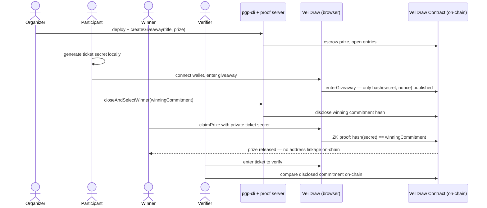
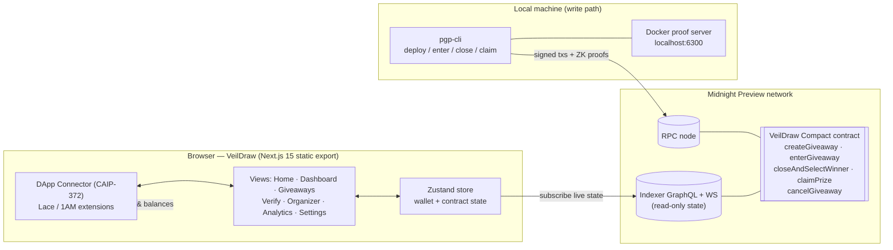

<div align="center">

# VeilDraw — Private Giveaway Platform

### Zero-Knowledge Proof Giveaways on Midnight

[](https://github.com/INdrajit88/veildraw/actions)
[](https://opensource.org/licenses/MIT)
[](https://nodejs.org)
[](https://docs.midnight.network)
[](https://www.risein.com/programs/new-moon-to-full-monthly-moonshots-on-midnight)
[](https://x.com/VeilDraww)

**Giveaways without exposing your identity.** Organizers escrow prizes in a Compact smart contract, participants enter with locally-generated ZK commitments, and winners claim by proving ticket ownership in zero knowledge — no wallet addresses, identities, or entry lists are ever published on-chain.

[**Live dApp →**](https://veildraw-pgp-ui.vercel.app/) · [**Video walkthrough →**](https://youtu.be/meczmnhMPWo) · [**Contract on Preview →**](#on-chain-deployment)

</div>

---

## Contents

- [Overview](#overview)
- [Privacy Model](#privacy-model)
- [How It Works](#how-it-works)
- [App Screenshots](#app-screenshots)
- [On-Chain Deployment](#on-chain-deployment)
- [App Architecture](#app-architecture)
- [Quick Start](#quick-start)
- [Demo and Test Accounts (Sample Data)](#demo-and-test-accounts-sample-data)
- [Tests and CI/CD](#tests-and-cicd)
- [Rise In Level 3 Checklist](#rise-in-level-3-checklist)
- [Level History](#level-history)
- [Repository and Links](#repository-and-links)

---

## Overview

VeilDraw is a privacy-preserving giveaway platform built on [Midnight](https://midnight.network). Organizers escrow prizes in a Compact smart contract; participants enter with locally-generated ZK commitments; winners claim prizes by proving ticket ownership in zero knowledge — no wallet addresses, identities, or entry lists are ever published on-chain.

The frontend is a premium **Next.js 15** static dApp (React 19, Tailwind, Framer Motion, shadcn/ui) with an immersive scroll-driven 3D story. It reads live state from the Midnight indexer and connects to Lace / 1AM wallets through the official DApp Connector API (CAIP-372).

This project is deployed against the **Midnight Preview Testnet** and is submitted for the **Rise In × Midnight "New Moon to Full" program — Level 3 (First Quarter): Production-Grade dApp**.

### Live Demo and Quick Links

| Resource | Link | Description |
|:---|:---|:---|
| **Live dApp** | [veildraw-pgp-ui.vercel.app](https://veildraw-pgp-ui.vercel.app/) | Next.js 15 ZK giveaway dApp on Midnight Preview |
| **Giveaway Portal** | [veildraw-pgp-ui.vercel.app/giveaways](https://veildraw-pgp-ui.vercel.app/giveaways) | Browse & enter active zero-knowledge giveaways |
| **Organizer Console** | [veildraw-pgp-ui.vercel.app/organizer](https://veildraw-pgp-ui.vercel.app/organizer) | Create giveaways & draw winners via ZK witness |
| **Winner Verification** | [veildraw-pgp-ui.vercel.app/verify](https://veildraw-pgp-ui.vercel.app/verify) | Verify ticket secrets & claim prizes on-chain |
| **Analytics & Telemetry** | [veildraw-pgp-ui.vercel.app/analytics](https://veildraw-pgp-ui.vercel.app/analytics) | Real-time indexer stats & proof performance |
| **Video Walkthrough** | [YouTube Demo](https://youtu.be/meczmnhMPWo) | End-to-end walkthrough video |
| **Midnight Preview Faucet** | [faucet.preview.midnight.network](https://faucet.preview.midnight.network/) | Get testnet tNIGHT tokens |
| **Official X (Twitter)** | [@VeilDraww](https://x.com/VeilDraww) | Official project updates & announcements |

---

## Privacy Model

The contract maintains a ZK accumulator tree of private entry commitments and accepts a private witness (ticket secret) that must match the organizer-selected winning commitment before the prize can be claimed.

| | What it includes |
|:---|:---|
| **PUBLIC** (on-chain, visible to anyone) | The entry accumulator state, entry count, winning commitment hash, and winner-claimed status |
| **PRIVATE** (local witness, never published) | The participant's ticket secret, nonce, and secret key — generated and held on the user's device |
| **PROVEN without revealing** | That the ticket secret hashes to the winning commitment and the claim transition is valid — via `persistentHash` inside the ZK circuit |

The UI surfaces proof status and on-chain results only; raw secrets never leave the device.

---

## How It Works



1. **Organizer** deploys the contract and creates a giveaway; the prize is escrowed.
2. **Participant** connects Lace/1AM, generates a ticket secret in-browser, and submits only the commitment hash.
3. **Organizer** closes entries and selects the winning commitment off-chain.
4. **Winner** proves ticket ownership in zero knowledge and claims — the chain never learns which address won.
5. **Verifier** (anyone) can independently confirm a winning ticket against the disclosed commitment.

---

## App Screenshots

### Desktop (1440×900)

| Home — 3D draw-pool hero | Scroll story — pipeline act |
|:---:|:---:|
|  |  |

| Giveaways | Dashboard |
|:---:|:---:|
|  |  |

| Winner Verification | Organizer Console |
|:---:|:---:|
|  |  |

| Analytics | Settings |
|:---:|:---:|
|  |  |

### Mobile (390×844)

| Home | Dashboard | Giveaways |
|:---:|:---:|:---:|
|  |  |  |

---

## On-Chain Deployment

| Network | Contract Address | Status | Live dApp / Explorer |
|:---|:---|:---|:---|
| **Midnight Preview** | [`0ec3244220040ce3538fd34bb22d6de29a2174bdb7d94b3f52ffc18829ef1fba`](https://veildraw-pgp-ui.vercel.app/giveaways) | **Active & Live** | [Open in VeilDraw Preview dApp](https://veildraw-pgp-ui.vercel.app/giveaways) |
| **Midnight Preview (pre-rewrite)** | `445563f8b0fa114ba33cde6a66f6de928de1f2a7bbe55a89ab4033d0b4dfe4b1` | *Superseded by the rewritten contract above — historical actions at blocks ~511k* | [Query via Indexer GraphQL](https://indexer.preview.midnight.network/api/v4/graphql) |
| **Midnight Preprod** | Standby | *Preprod dust-ledger sync exceeds RAM limits on local hardware; Preview is the primary live testnet.* | [Preview Indexer API](https://indexer.preview.midnight.network/api/v4/graphql) |

### Deployment Details (Preview Testnet)

| Deployment Fact | Value | Verification Link |
|:---|:---|:---|
| **Active Giveaway** | `VeilDraw Preview Giveaway` (5,000 tNIGHT prize) | [View in Live Portal](https://veildraw-pgp-ui.vercel.app/giveaways) |
| **Contract Address** | `0ec3244220040ce3538fd34bb22d6de29a2174bdb7d94b3f52ffc18829ef1fba` | [Open in Preview App](https://veildraw-pgp-ui.vercel.app/giveaways) |
| **Deploy Transaction** | `4dea31dca9a52a5c58e52504c86e8725f742169479810d40d43e7d4a35b5ea9d` | [Query via Indexer GraphQL](https://indexer.preview.midnight.network/api/v4/graphql) |
| **Verified Block** | Block `606,152` (Preview indexer `contractAction`) | [Preview Indexer API](https://indexer.preview.midnight.network/api/v4/graphql) |
| **Create-Giveaway Tx** | `a4fe5727b4277677a167c64b494a1d7577a84551cd0fbf3eb5e6dc4167c58101` (Block `606,157`) | [Query via Indexer GraphQL](https://indexer.preview.midnight.network/api/v4/graphql) |
| **Organizer Wallet** | `mn_addr_preview1lps20dj6gj6fdpnvlz7vj7tlqgdevrnewukkl656d5wl07ft95ksg42xe3` | [Preview Faucet Portal](https://faucet.preview.midnight.network/) |

### Network Infrastructure and Verification Endpoints

| Service | Endpoint URL | Purpose |
|:---|:---|:---|
| **Preview Node RPC** | [`https://rpc.preview.midnight.network`](https://rpc.preview.midnight.network) | Remote RPC node for state & tx submission |
| **Preview Indexer GraphQL** | [`https://indexer.preview.midnight.network/api/v4/graphql`](https://indexer.preview.midnight.network/api/v4/graphql) | Live query interface for on-chain contract state |
| **Preview Indexer WebSocket** | `wss://indexer.preview.midnight.network/api/v4/graphql/ws` | Real-time state subscription stream |
| **Preview Faucet Portal** | [`https://faucet.preview.midnight.network/`](https://faucet.preview.midnight.network/) | Testnet tNIGHT faucet for wallet funding |

---

## App Architecture



**Design notes**

- **Read path (browser):** the UI subscribes to the Preview indexer over GraphQL/WebSocket and renders live contract state — no simulated data anywhere.
- **Write path (CLI):** proving + signing requires the local proof server, so `pgp-cli` submits real transactions (deploy, enter, close, claim) against the RPC node.
- **Wallet connect:** the browser uses the real injected `window.midnight.*` connector (`connect(networkId)` → `getUnshieldedAddress()` / `getShieldedAddresses()` / balances). No fabricated fallback addresses.
- **Single network source:** `pgp-ui/lib/network.ts` derives every label/endpoint from `NEXT_PUBLIC_NETWORK_ID` (`build:preview` / `build:preprod`).

### Repository Structure

```
veildraw/
├── contract/            # Compact ZK contract + 17 Vitest tests
│   ├── src/             #   pgp.compact, witnesses.ts, managed/ (compiled zkir + keys)
│   └── test/pgp.test.ts
├── api/                 # Shared API types & helpers
├── pgp-cli/             # Interactive CLI: deploy / join / enter / close / claim
│   └── src/             #   launchers: preview.ts, preprod.ts, standalone.ts
├── pgp-ui/              # Next.js 15 App Router static dApp
│   ├── app/             #   routes: / /dashboard /giveaways /verify /organizer /analytics /settings
│   ├── components/      #   views, layout, modals (Wallet, Transaction), 3D scene, motion
│   ├── lib/             #   store, network config, scene bridge, types, utils
│   └── utils/           #   midnightWallet (connector), midnightService (indexer)
├── scripts/             # docs helpers (demo-table generator)
├── .github/workflows/   # ci.yml — CI/CD pipeline
├── docs/screenshots/    # desktop + mobile captures
├── vercel.json          # CD: auto-deploy to Vercel on main
└── PROPOSAL.md          # product proposal
```

---

## Quick Start

### Prerequisites

- Node.js v24.11.1+
- Docker (proof server)
- Lace or 1AM wallet extension set to **Preview**

### Run the UI

```bash
git clone https://github.com/INdrajit88/veildraw.git
cd veildraw
npm install
npm run dev                      # Next.js dev server
# or production static build for Preview:
npm run preview                  # build:preview + serve ./out
```

### Run the CLI (deploy / interact)

```bash
docker run -d --name pgp-proof-server --rm -p 6300:6300 -e PORT=6300 midnightntwrk/proof-server:8.1.0
cd pgp-cli
npm run preview-remote           # interactive: deploy / join / enter / close / claim
```

### Scripts

| Script | Purpose |
|--------|---------|
| `npm test --workspace=@midnight-ntwrk/pgp-contract` | Contract unit tests (circuit / state / privacy) |
| `npm run build` | Build contract + API + UI workspaces |
| `npm run dev` | Next.js dev server |
| `npm run preview` | Static Preview build + local server |
| `cd pgp-ui && npm run build:preview` | Production static export targeting **Preview** Testnet |
| `cd pgp-ui && npm run build:preprod` | Production static export targeting **Preprod** Testnet |
| `cd pgp-cli && npm run preview-remote` | CLI: deploy / interact with Preview contract |

---

## Demo and Test Accounts (Sample Data)

> ⚠️ **Sample data only.** The accounts below are illustrative, off-chain values for exercising the UI locally (entry-portal commitment preview, verification input, claim form). They are **not** on-chain participants, hold no funds, and were never submitted to the contract. Per the privacy model above, no participant list like this can ever exist on-chain — real participants generate secrets on their own device and only opaque 32-byte commitments reach the contract.

Secrets are derived deterministically as `sha256("veildraw-demo-secret-<n>")`; nonces are the first 16 hex chars of `sha256("veildraw-demo-nonce-<n>")`. The commitment column is the local preview the entry portal itself produces from `${secret}:${nonce}` (same derivation as `GiveawayPortal`), not an on-chain value. Regenerate the table with `node scripts/gen-demo-table.mjs`.

| # | Alias | Ticket secret (hex) | Nonce | Entry commitment preview (hex) |
|:---|:---|:---|:---|:---|
| 01 | `demo-user-01` | `84d11d5eff2f101ae9e6e25f642e968261399cff316afd0b8b4cffd52aa6e575` | `592bac3823452068` | `804ab016a02c305638dc7814a02ab88ca8ba34e4d062200c804e2846e01cf43e` |
| 02 | `demo-user-02` | `a3fba120d7183449beb59e0054bdb2110da54c8a6c6f1f47495c52a9ac027286` | `6323869bcfa4fcba` | `7864bca0c0109046e8223c00b02868560092c48ea06c384ac8de78def0045884` |
| 03 | `demo-user-03` | `a801410f93250161a8f89b62057e2e54cfd60643119d5da9c7f613fe6c2d6b3f` | `2897efa5de41df5b` | `700acc04702a04e6706038ec007a6498504c084af098f056586cb4e6a02828f4` |
| 04 | `demo-user-04` | `0045f706e7eb84149bf1c2f9eccc2f99e039cc90297be8516afce98b40fd8821` | `c0c8cc33af2992d9` | `00422404b0548058f06a18eeb03668d630ba1450e074f096a86e7c8cc06880a6` |
| 05 | `demo-user-05` | `406f04c00b33e2c1b9981eb622869458f2ac145677d9d6b9d68bd559a1dd05fa` | `60b369fc6fc294a2` | `c06c00700036f8f6e810bca4e08cb090a09eb0149042c8a6c084cc1ef04804e6` |
| 06 | `demo-user-06` | `e39ab0f2030bee9f02b7844468e1e2a24803bae8807610c4a28882f1d6aee3a3` | `88742786930aa5ef` | `381a60ec0004f4d400268048a052f85cc00e6c10807c30f8708088eec01afc52` |
| 07 | `demo-user-07` | `28612b7486dea934947b4385668dabb01895635d873ccc8260bf634ded38e254` | `f0f2a95ee213c073` | `e06a68b8804a34f8f0f4c486a08838a07012241880369c8ca02c2448b030f898` |
| 08 | `demo-user-08` | `2e37fa12c9f5a3ea3b1cb20210a08a01d77a1e2c939c8c0d440d626123eddd67` | `b872509872b04b8e` | `e8b62cdcd06a3c96509e680cf0108406c8fabcaa70968c08c00828eee058c0ea` |
| 09 | `demo-user-09` | `7545e07faa0eac9ee8024a9c4632648cbebb2f322052a05d74d149ffe215976d` | `70b1c08f12b02f94` | `184270b4f00a3cde3004cc5ac0342082e824687ce0543098104acce4b01abce8` |
| 10 | `demo-user-10` | `2502b8dce5375c8e5ab37d5c0ddb22f5d6f2e3aad30b3da128f6c4cf659fb45a` | `104d37d43c9e62ff` | `e804604ab03efc8e382ed01a004468eec06474dec0049056e06c1074a09c6096` |
| 11 | `demo-user-11` | `58e89c619375d9321f7c1c0a6328b86f2b9c1be7db515eb3a9594066c8580862` | `486039fa99ac6dda` | `30d034ee707ac4fc70feb40ea02060e4e01eb812c052f4a278dac0e4d05000ec` |
| 12 | `demo-user-12` | `d25e0488f582ccc28e44d28ea0fb0466c5487961ea50476dc7c412df07947418` | `30f8ae832d0a6d9b` | `c0d20080a0849cfc8848c886f06400e45840dceeb050cce858b8b84400985050` |
| 13 | `demo-user-13` | `9d540e6daae103d9fa84b5b03ef1b3467451c9deb63a0f94bc8871ad59da8962` | `10cd7a665050d20b` | `f0d80ce8f0520c46a8886ca0d0626c4410da1c46e03208d8e880dcd8b04284ec` |
| 14 | `demo-user-14` | `4bd6dfa741d03b0aaa5e0c38ee742def39887ec35860be44968454f6cd4162d5` | `3dbdea4d769d17f2` | `c04cc8d2c040980678d20470b07860945880dc7ab0606448f08870e4d042284e` |
| 15 | `demo-user-15` | `105f8eeff9d91852f61e40c29c3d6fce26fa46f2033848bff9922d8b78bbfc98` | `74c086a027800923` | `70dc8c14a042309ca092c07c703828fee06ac8ec0030c0a4a814608c90242cd0` |
| 16 | `demo-user-16` | `aeb92b6c244a4660d60cbf9354801dd924de4fe5a788355037ed2693b5cbce88` | `29b23202c5c72601` | `782a68eae042c8e0c00e685ab0803046e042c816f080949058d8685ae0349480` |
| 17 | `demo-user-17` | `43cf17949ea29b49ab6076e001681ba82b2d4d4a7d804fc4c3d1101a8019fdea` | `d4e33d9d37b8fa74` | `c8bcb4587014b8467060d81000603850e028c04e9080c8f8584ab0de80122096` |
| 18 | `demo-user-18` | `d6cb6f44034c560cddca22aa717eb8d7cb4a3cb1da9db54fcb759fbb59ae5d25` | `354522fcd2db7fdf` | `c0b428480046f802c0ba68de907a604a504a14aec098644450f238acb01af0ae` |
| 19 | `demo-user-19` | `3c13825a46ee5c6c0cbbd5f5e75e9454a2dff57138f64b259a05b4316a85275b` | `6f02a894c12e2d78` | `589e881ec05afce20824cce6b05ab098704c2cbed06cc8aef802607ea08a6c9c` |
| 20 | `demo-user-20` | `34986f693dcb43c4fb4b38a88c5fadfae50cbd85d27dd884a9bd2575971f1b5f` | `ec8795dcc0de734c` | `501028eed034ccf8a04410d0805c30e6380e6086c078c08878286cb6701c3894` |

---

## Tests and CI/CD

### Test Suite

17 tests covering: pure circuit behavior, witness extraction privacy, private-state isolation, state-machine constraints, compiled contract shape, and publicKey determinism.

```bash
npm test --workspace=@midnight-ntwrk/pgp-contract -- --run
```

### CI/CD

**CI** runs on every push to `main`/`dev` and every PR: checkout → Node 24 → install → contract typecheck → contract lint → unit tests → build contract, API, CLI, and UI workspaces.

**CD** deploys the UI to Vercel on every push to `main` (`vercel.json`), live at [veildraw-pgp-ui.vercel.app](https://veildraw-pgp-ui.vercel.app/) targeting the **Midnight Preview Testnet**.

---

## Rise In Level 3 Checklist

Level 3 (First Quarter) of the ["New Moon to Full" program](https://www.risein.com/programs/new-moon-to-full-monthly-moonshots-on-midnight) requires a **polished dApp**, **tests**, **CI/CD**, and a problem picked from the provided list (privacy-preserving on-chain verification). Status:

| Requirement | Status |
|-------------|--------|
| Polished, production-grade dApp | ✅ Next.js 15 premium UI — 3D scroll story, animated hero, scroll reveals, frosted sub-nav, pill CTAs; fully responsive (see [screenshots](#app-screenshots)) |
| 3+ meaningful tests (circuit / state / privacy) | ✅ **17 Vitest tests** in [`contract/test/pgp.test.ts`](contract/test/pgp.test.ts) |
| CI/CD pipeline on push to main | ✅ [`.github/workflows/ci.yml`](.github/workflows/ci.yml) — typecheck → lint → test → build (4 workspaces) → Vercel deploy |
| CI badge in README | ✅ Top of this file |
| Contract address in README, verifiable on-chain | ✅ [Preview address + deploy tx + block height](#on-chain-deployment) |
| Privacy model documented | ✅ [Privacy Model](#privacy-model) section |
| UI reads real on-chain state | ✅ Indexer GraphQL/WS subscription — no simulated transactions |
| Real wallet integration | ✅ Lace / 1AM via `@midnight-ntwrk/dapp-connector-api` (CAIP-372) |
| dApp builds with zero errors | ✅ `npm run build` green across all workspaces |
| Product proposal | ✅ [PROPOSAL.md](PROPOSAL.md) |
| Problem statement addressed | ✅ Private, verifiable giveaways — ZK winner selection without identity disclosure |

---

## Level History

### Level 1 — New Moon: Setup & First Contract

Compact contract with a ZK entry accumulator, local Vitest suite, and testnet deployment with documented privacy behavior. Tech: Compact, Node 24, Docker proof server.

### Level 2 — Waxing Crescent: Frontend Integration

Contract wired to a browser UI with Lace/1AM connect + disconnect via the DApp Connector API, circuit calls (`enterGiveaway`, `closeAndSelectWinner`, `claimPrize`) with honest error handling, and local private-state management.

### Level 3 — First Quarter: Production-Grade dApp *(this submission)*

- Rebuilt the frontend as a **Next.js 15 App Router** static export with a premium, animated, fully responsive design system and an immersive scroll-driven 3D story.
- Full test suite, CI/CD pipeline, Vercel CD, live on-chain state, architecture & user-flow documentation, desktop + mobile screenshots.

---

## Repository and Links

- **X (Twitter):** [@VeilDraww](https://x.com/VeilDraww)
- **GitHub:** [github.com/INdrajit88/veildraw](https://github.com/INdrajit88/veildraw)
- **Live Demo:** [veildraw-pgp-ui.vercel.app](https://veildraw-pgp-ui.vercel.app/)
- **Demo Video:** [youtu.be/meczmnhMPWo](https://youtu.be/meczmnhMPWo)
- **Program:** [Rise In — New Moon to Full](https://www.risein.com/programs/new-moon-to-full-monthly-moonshots-on-midnight)
- **Support:** [SUPPORT.md](SUPPORT.md) • **Proposal:** [PROPOSAL.md](PROPOSAL.md)

**License:** MIT
