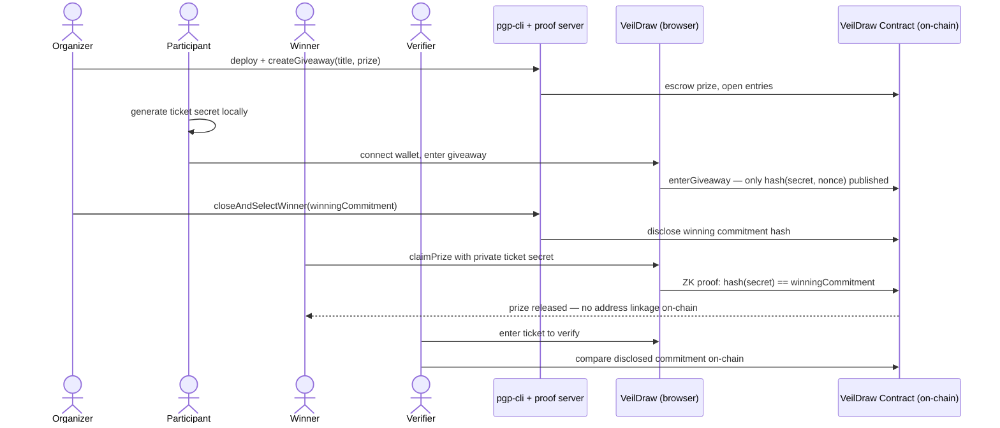
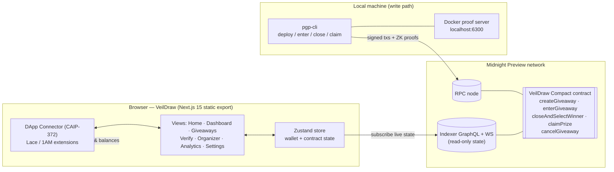

<div align="center">

# VeilDraw — Private Giveaway Platform

### Zero-Knowledge Proof Giveaways on Midnight

[](https://github.com/INdrajit88/veildraw/actions)
[](https://opensource.org/licenses/MIT)
[](https://nodejs.org)
[](https://docs.midnight.network)
[](https://www.risein.com/programs/new-moon-to-full-monthly-moonshots-on-midnight)
[](https://x.com/VeilDraww)

**Giveaways without exposing your identity.** Organizers escrow prizes in a Compact smart contract, participants enter with locally-generated ZK commitments, and winners claim by proving ticket ownership in zero knowledge — no wallet addresses, identities, or entry lists are ever published on-chain.

[**Live dApp →**](https://veildraw-pgp-ui.vercel.app/) · [**Video walkthrough →**](https://youtu.be/meczmnhMPWo) · [**Contract on Preview →**](#on-chain-deployment)

</div>

---

## Contents

- [Overview](#overview)
- [Privacy Model](#privacy-model)
- [How It Works](#how-it-works)
- [App Screenshots](#app-screenshots)
- [On-Chain Deployment](#on-chain-deployment)
- [App Architecture](#app-architecture)
- [Quick Start](#quick-start)
- [Repository and Links](#repository-and-links)

---

## Overview

VeilDraw is a privacy-preserving giveaway platform built on [Midnight](https://midnight.network). Organizers escrow prizes in a Compact smart contract; participants enter with locally-generated ZK commitments; winners claim prizes by proving ticket ownership in zero knowledge — no wallet addresses, identities, or entry lists are ever published on-chain.

The frontend is a premium **Next.js 15** static dApp (React 19, Tailwind, Framer Motion, shadcn/ui) with an immersive scroll-driven 3D story. It reads live state from the Midnight indexer and connects to Lace / 1AM wallets through the official DApp Connector API (CAIP-372).

This project is deployed against the **Midnight Preview Testnet** and is submitted for the **Rise In × Midnight "New Moon to Full" program — Level 3 (First Quarter): Production-Grade dApp**.

### Live Demo and Quick Links

| Resource | Link | Description |
|:---|:---|:---|
| **Live dApp** | [veildraw-pgp-ui.vercel.app](https://veildraw-pgp-ui.vercel.app/) | Next.js 15 ZK giveaway dApp on Midnight Preview |
| **Giveaway Portal** | [veildraw-pgp-ui.vercel.app/giveaways](https://veildraw-pgp-ui.vercel.app/giveaways) | Browse & enter active zero-knowledge giveaways |
| **Organizer Console** | [veildraw-pgp-ui.vercel.app/organizer](https://veildraw-pgp-ui.vercel.app/organizer) | Create giveaways & draw winners via ZK witness |
| **Winner Verification** | [veildraw-pgp-ui.vercel.app/verify](https://veildraw-pgp-ui.vercel.app/verify) | Verify ticket secrets & claim prizes on-chain |
| **Analytics & Telemetry** | [veildraw-pgp-ui.vercel.app/analytics](https://veildraw-pgp-ui.vercel.app/analytics) | Real-time indexer stats & proof performance |
| **Video Walkthrough** | [YouTube Demo](https://youtu.be/meczmnhMPWo) | End-to-end walkthrough video |
| **Midnight Preview Faucet** | [faucet.preview.midnight.network](https://faucet.preview.midnight.network/) | Get testnet tNIGHT tokens |
| **Official X (Twitter)** | [@VeilDraww](https://x.com/VeilDraww) | Official project updates & announcements |

---

## Privacy Model

The contract maintains a ZK accumulator tree of private entry commitments and accepts a private witness (ticket secret) that must match the organizer-selected winning commitment before the prize can be claimed.

| | What it includes |
|:---|:---|
| **PUBLIC** (on-chain, visible to anyone) | The entry accumulator state, entry count, winning commitment hash, and winner-claimed status |
| **PRIVATE** (local witness, never published) | The participant's ticket secret, nonce, and secret key — generated and held on the user's device |
| **PROVEN without revealing** | That the ticket secret hashes to the winning commitment and the claim transition is valid — via `persistentHash` inside the ZK circuit |

The UI surfaces proof status and on-chain results only; raw secrets never leave the device.

---

## How It Works



1. **Organizer** deploys the contract and creates a giveaway; the prize is escrowed.
2. **Participant** connects Lace/1AM, generates a ticket secret in-browser, and submits only the commitment hash.
3. **Organizer** closes entries and selects the winning commitment off-chain.
4. **Winner** proves ticket ownership in zero knowledge and claims — the chain never learns which address won.
5. **Verifier** (anyone) can independently confirm a winning ticket against the disclosed commitment.

---

## App Screenshots

### Desktop (1440×900)

| Home — 3D draw-pool hero | Scroll story — pipeline act |
|:---:|:---:|
|  |  |

| Giveaways | Dashboard |
|:---:|:---:|
|  |  |

| Winner Verification | Organizer Console |
|:---:|:---:|
|  |  |

| Analytics | Settings |
|:---:|:---:|
|  |  |

### Mobile (390×844)

| Home | Dashboard | Giveaways |
|:---:|:---:|:---:|
|  |  |  |

---

## On-Chain Deployment

| Network | Contract Address | Status | Live dApp / Explorer |
|:---|:---|:---|:---|
| **Midnight Preview** | [`0ec3244220040ce3538fd34bb22d6de29a2174bdb7d94b3f52ffc18829ef1fba`](https://veildraw-pgp-ui.vercel.app/giveaways) | **Active & Live** | [Open in VeilDraw Preview dApp](https://veildraw-pgp-ui.vercel.app/giveaways) |
| **Midnight Preview (pre-rewrite)** | `445563f8b0fa114ba33cde6a66f6de928de1f2a7bbe55a89ab4033d0b4dfe4b1` | *Superseded by the rewritten contract above — historical actions at blocks ~511k* | [Query via Indexer GraphQL](https://indexer.preview.midnight.network/api/v4/graphql) |
| **Midnight Preprod** | Standby | *Preprod dust-ledger sync exceeds RAM limits on local hardware; Preview is the primary live testnet.* | [Preview Indexer API](https://indexer.preview.midnight.network/api/v4/graphql) |

### Deployment Details (Preview Testnet)

| Deployment Fact | Value | Verification Link |
|:---|:---|:---|
| **Active Giveaway** | `VeilDraw Preview Giveaway` (5,000 tNIGHT prize) | [View in Live Portal](https://veildraw-pgp-ui.vercel.app/giveaways) |
| **Contract Address** | `0ec3244220040ce3538fd34bb22d6de29a2174bdb7d94b3f52ffc18829ef1fba` | [Open in Preview App](https://veildraw-pgp-ui.vercel.app/giveaways) |
| **Deploy Transaction** | `4dea31dca9a52a5c58e52504c86e8725f742169479810d40d43e7d4a35b5ea9d` | [Query via Indexer GraphQL](https://indexer.preview.midnight.network/api/v4/graphql) |
| **Verified Block** | Block `606,152` (Preview indexer `contractAction`) | [Preview Indexer API](https://indexer.preview.midnight.network/api/v4/graphql) |
| **Create-Giveaway Tx** | `a4fe5727b4277677a167c64b494a1d7577a84551cd0fbf3eb5e6dc4167c58101` (Block `606,157`) | [Query via Indexer GraphQL](https://indexer.preview.midnight.network/api/v4/graphql) |
| **Organizer Wallet** | `mn_addr_preview1lps20dj6gj6fdpnvlz7vj7tlqgdevrnewukkl656d5wl07ft95ksg42xe3` | [Preview Faucet Portal](https://faucet.preview.midnight.network/) |

### Network Infrastructure and Verification Endpoints

| Service | Endpoint URL | Purpose |
|:---|:---|:---|
| **Preview Node RPC** | [`https://rpc.preview.midnight.network`](https://rpc.preview.midnight.network) | Remote RPC node for state & tx submission |
| **Preview Indexer GraphQL** | [`https://indexer.preview.midnight.network/api/v4/graphql`](https://indexer.preview.midnight.network/api/v4/graphql) | Live query interface for on-chain contract state |
| **Preview Indexer WebSocket** | `wss://indexer.preview.midnight.network/api/v4/graphql/ws` | Real-time state subscription stream |
| **Preview Faucet Portal** | [`https://faucet.preview.midnight.network/`](https://faucet.preview.midnight.network/) | Testnet tNIGHT faucet for wallet funding |

---

## App Architecture



**Design notes**

- **Read path (browser):** the UI subscribes to the Preview indexer over GraphQL/WebSocket and renders live contract state — no simulated data anywhere.
- **Write path (CLI):** proving + signing requires the local proof server, so `pgp-cli` submits real transactions (deploy, enter, close, claim) against the RPC node.
- **Wallet connect:** the browser uses the real injected `window.midnight.*` connector (`connect(networkId)` → `getUnshieldedAddress()` / `getShieldedAddresses()` / balances). No fabricated fallback addresses.
- **Single network source:** `pgp-ui/lib/network.ts` derives every label/endpoint from `NEXT_PUBLIC_NETWORK_ID` (`build:preview` / `build:preprod`).

### Repository Structure

```
veildraw/
├── contract/            # Compact ZK contract + 17 Vitest tests
│   ├── src/             #   pgp.compact, witnesses.ts, managed/ (compiled zkir + keys)
│   └── test/pgp.test.ts
├── api/                 # Shared API types & helpers
├── pgp-cli/             # Interactive CLI: deploy / join / enter / close / claim
│   └── src/             #   launchers: preview.ts, preprod.ts, standalone.ts
├── pgp-ui/              # Next.js 15 App Router static dApp
│   ├── app/             #   routes: / /dashboard /giveaways /verify /organizer /analytics /settings
│   ├── components/      #   views, layout, modals (Wallet, Transaction), 3D scene, motion
│   ├── lib/             #   store, network config, scene bridge, types, utils
│   └── utils/           #   midnightWallet (connector), midnightService (indexer)
├── .github/workflows/   # ci.yml — CI/CD pipeline
├── docs/screenshots/    # desktop + mobile captures
├── vercel.json          # CD: auto-deploy to Vercel on main
└── PROPOSAL.md          # product proposal
```

---

## Quick Start

### Prerequisites

- Node.js v24.11.1+
- Docker (proof server)
- Lace or 1AM wallet extension set to **Preview**

### Run the UI

```bash
git clone https://github.com/INdrajit88/veildraw.git
cd veildraw
npm install
npm run dev                      # Next.js dev server
# or production static build for Preview:
npm run preview                  # build:preview + serve ./out
```

### Run the CLI (deploy / interact)

```bash
docker run -d --name pgp-proof-server --rm -p 6300:6300 -e PORT=6300 midnightntwrk/proof-server:8.1.0
cd pgp-cli
npm run preview-remote           # interactive: deploy / join / enter / close / claim
```

### Scripts

| Script | Purpose |
|--------|---------|
| `npm test --workspace=@midnight-ntwrk/pgp-contract` | Contract unit tests (circuit / state / privacy) |
| `npm run build` | Build contract + API + UI workspaces |
| `npm run dev` | Next.js dev server |
| `npm run preview` | Static Preview build + local server |
| `cd pgp-ui && npm run build:preview` | Production static export targeting **Preview** Testnet |
| `cd pgp-ui && npm run build:preprod` | Production static export targeting **Preprod** Testnet |
| `cd pgp-cli && npm run preview-remote` | CLI: deploy / interact with Preview contract |

---

## Repository and Links

- **X (Twitter):** [@VeilDraww](https://x.com/VeilDraww)
- **GitHub:** [github.com/INdrajit88/veildraw](https://github.com/INdrajit88/veildraw)
- **Live Demo:** [veildraw-pgp-ui.vercel.app](https://veildraw-pgp-ui.vercel.app/)
- **Demo Video:** [youtu.be/meczmnhMPWo](https://youtu.be/meczmnhMPWo)
- **Program:** [Rise In — New Moon to Full](https://www.risein.com/programs/new-moon-to-full-monthly-moonshots-on-midnight)
- **Support:** [SUPPORT.md](SUPPORT.md) • **Proposal:** [PROPOSAL.md](PROPOSAL.md)

**License:** MIT
